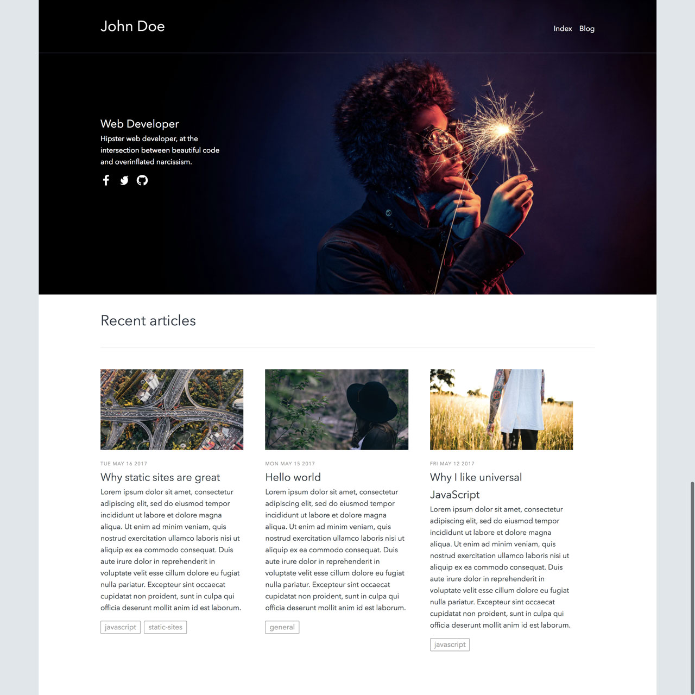

# blog-in-5-min

> A statically rendered blog based on Contentful

This project is the result of our [Interactive getting started CLI tutorial](https://www.contentful.com/developers/docs/tutorials/general/get-started/). The [Contentful CLI](https://www.npmjs.com/package/contentful-cli) helps you automating things like the creation of spaces and access tokens. We recommend using it to bootstrap this project.

## Introduction

The project can be used as a base to get you started with Contentful. It includes the following features:

- static site generation
- dynamic server side rendering for development
- deploy to [now](https://zeit.co/now)
- responsive images via [Images API](https://www.contentful.com/developers/docs/references/images-api/)
- tags for blog posts

## Getting started

In case you want to see how to set up a project yourself please check out [the getting started guide](./docs/GETTING-STARTED.md).

## Technical stack

This project is based on [nuxt.js](https://nuxtjs.org/).

### Why nuxt.js?

Nuxt.js is based on [Vue.js](https://vuejs.org/). Vue is a fairly new JS framework that provides excellent documentation and is a pleasure to work with. nuxt.js sits on top of Vue and was choosen because of two main feature:

- dynamic server side rendering for development
- static file generation for production

For detailed explanation on how things work, check out the [Nuxt.js docs](https://github.com/nuxt/nuxt.js).

